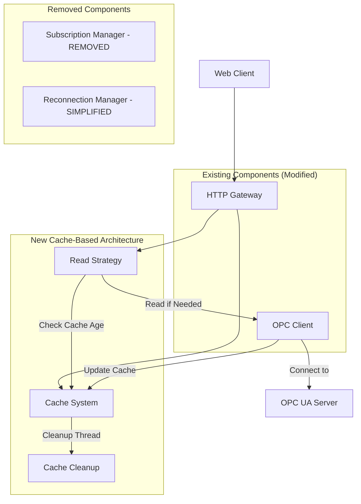
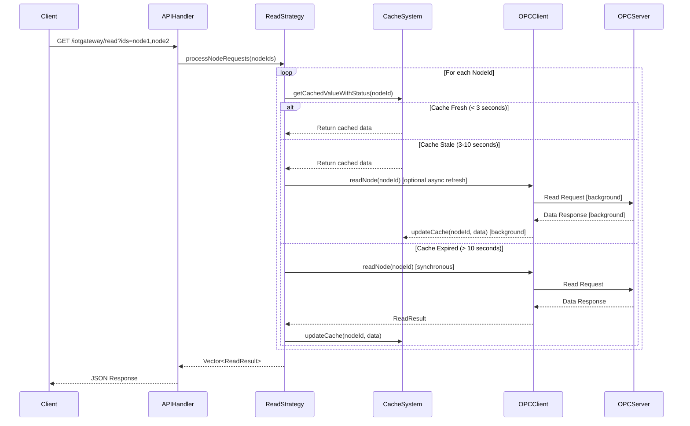

# Design Document

## Overview

本设计文档描述了将现有基于订阅的OPC UA到HTTP网关重构为基于智能缓存的系统。新系统将实现3秒刷新阈值和10秒过期时间的缓存策略，以解决部分OPC UA服务器不支持订阅的问题，同时保持高性能和完全的API兼容性。

### 核心设计原则

1. **完全向后兼容**: 保持现有HTTP API接口不变
2. **智能缓存策略**: 3秒内直接返回缓存，3-10秒重新读取并更新，超过10秒强制重新读取
3. **高并发性能**: 使用读写锁和原子操作优化并发访问
4. **优雅降级**: OPC UA连接失败时返回缓存数据（如果可用）

## Architecture

### 系统架构图



### 组件交互流程



## Components and Interfaces

### 1. Enhanced Cache System

#### CacheEntry Structure (Enhanced)
```cpp
struct CacheEntry {
    std::string nodeId;
    std::string value;
    std::string status;
    std::string reason;
    uint64_t timestamp;
    std::chrono::steady_clock::time_point creationTime;    // NEW: 缓存创建时间
    std::chrono::steady_clock::time_point lastAccessed;   // MODIFIED: 最后访问时间
    
    // NEW: Cache age evaluation methods
    bool isWithinRefreshThreshold(std::chrono::seconds threshold) const;
    bool isExpired(std::chrono::seconds expireTime) const;
    std::chrono::seconds getAge() const;
};
```

#### Cache Manager Interface (Enhanced)
```cpp
class CacheManager {
public:
    // NEW: Configuration-based constructor
    CacheManager(std::chrono::seconds refreshThreshold = std::chrono::seconds(3),
                std::chrono::seconds expireTime = std::chrono::seconds(10),
                std::chrono::seconds cleanupInterval = std::chrono::seconds(60));
    
    // NEW: Smart cache retrieval with age evaluation
    enum class CacheStatus {
        FRESH,      // < refreshThreshold, use directly
        STALE,      // refreshThreshold < age < expireTime, return cache + background update
        EXPIRED     // > expireTime, must refresh synchronously
    };
    
    struct CacheResult {
        std::optional<CacheEntry> entry;
        CacheStatus status;
    };
    
    CacheResult getCachedValueWithStatus(const std::string& nodeId);
    
    // ENHANCED: Thread-safe batch operations
    std::vector<CacheResult> getCachedValuesWithStatus(const std::vector<std::string>& nodeIds);
    void updateCacheBatch(const std::vector<ReadResult>& results);
    
    // NEW: Configuration management
    void setRefreshThreshold(std::chrono::seconds threshold);
    void setExpireTime(std::chrono::seconds expireTime);
    void setCleanupInterval(std::chrono::seconds interval);
    
private:
    std::chrono::seconds refreshThreshold_;
    std::chrono::seconds expireTime_;
    std::chrono::seconds cleanupInterval_;
    
    // ENHANCED: More efficient locking strategy
    mutable std::shared_mutex cacheMutex_;
    std::atomic<bool> cleanupRunning_{false};
};
```

### 2. New Read Strategy Component

#### ReadStrategy Interface
```cpp
class ReadStrategy {
public:
    ReadStrategy(CacheManager* cacheManager, OPCUAClient* opcClient);
    
    // Main processing methods
    std::vector<ReadResult> processNodeRequests(const std::vector<std::string>& nodeIds);
    ReadResult processNodeRequest(const std::string& nodeId);
    
    // Batch optimization
    struct BatchReadPlan {
        std::vector<std::string> freshNodes;      // Return from cache
        std::vector<std::string> staleNodes;      // Return cache + background update
        std::vector<std::string> expiredNodes;    // Must read synchronously
    };
    
    BatchReadPlan createBatchPlan(const std::vector<std::string>& nodeIds);
    std::vector<ReadResult> executeBatchPlan(const BatchReadPlan& plan);
    
    // Background update management
    void scheduleBackgroundUpdate(const std::string& nodeId);
    void scheduleBackgroundUpdates(const std::vector<std::string>& nodeIds);
    
    // Concurrency control
    void enableConcurrencyControl(bool enabled);
    void setMaxConcurrentReads(size_t maxReads);
    
private:
    CacheManager* cacheManager_;
    OPCUAClient* opcClient_;
    BackgroundUpdater* backgroundUpdater_;  // NEW: Background update component
    
    // Concurrency control
    std::mutex readMutex_;
    std::unordered_set<std::string> activeReads_;
    std::condition_variable readCondition_;
    std::atomic<bool> concurrencyControlEnabled_{true};
    size_t maxConcurrentReads_{10};
    
    // Helper methods
    bool acquireReadLock(const std::string& nodeId);
    void releaseReadLock(const std::string& nodeId);
    ReadResult handleConcurrentRead(const std::string& nodeId);
};

#### BackgroundUpdater Component (NEW)
```cpp
class BackgroundUpdater {
public:
    BackgroundUpdater(CacheManager* cacheManager, OPCUAClient* opcClient);
    ~BackgroundUpdater();
    
    // Background update scheduling
    void scheduleUpdate(const std::string& nodeId);
    void scheduleBatchUpdate(const std::vector<std::string>& nodeIds);
    
    // Configuration
    void setMaxConcurrentUpdates(size_t maxUpdates);
    void setUpdateQueueSize(size_t maxQueueSize);
    void setUpdateTimeout(std::chrono::milliseconds timeout);
    
    // Control
    void start();
    void stop();
    bool isRunning() const;
    
    // Statistics
    struct UpdateStats {
        uint64_t totalUpdates{0};
        uint64_t successfulUpdates{0};
        uint64_t failedUpdates{0};
        uint64_t queuedUpdates{0};
        double averageUpdateTime{0.0};
    };
    
    UpdateStats getStats() const;
    
private:
    CacheManager* cacheManager_;
    OPCUAClient* opcClient_;
    
    // Thread management
    std::vector<std::thread> workerThreads_;
    std::atomic<bool> running_{false};
    
    // Update queue
    std::queue<std::string> updateQueue_;
    std::mutex queueMutex_;
    std::condition_variable queueCondition_;
    
    // Configuration
    size_t maxConcurrentUpdates_{3};
    size_t maxQueueSize_{1000};
    std::chrono::milliseconds updateTimeout_{5000};
    
    // Deduplication
    std::unordered_set<std::string> pendingUpdates_;
    std::mutex pendingMutex_;
    
    // Statistics
    mutable std::atomic<uint64_t> totalUpdates_{0};
    mutable std::atomic<uint64_t> successfulUpdates_{0};
    mutable std::atomic<uint64_t> failedUpdates_{0};
    
    // Worker methods
    void workerLoop();
    void processUpdate(const std::string& nodeId);
    bool addToPendingUpdates(const std::string& nodeId);
    void removeFromPendingUpdates(const std::string& nodeId);
};
```

### 3. Modified API Handler

#### APIHandler Changes
```cpp
class APIHandler {
private:
    // REMOVED: SubscriptionManager* subscriptionManager_;
    // NEW: ReadStrategy* readStrategy_;
    ReadStrategy* readStrategy_;
    
    // MODIFIED: Process requests through ReadStrategy
    std::vector<ReadResult> processNodeRequests(const std::vector<std::string>& nodeIds) override;
    
    // NEW: Enhanced error handling for cache-based system
    ReadResult handleOPCConnectionError(const std::string& nodeId);
    crow::response buildCacheErrorResponse(const std::string& nodeId, const std::string& error);
};
```

### 4. Simplified OPC UA Client

#### OPCUAClient Interface (Simplified)
```cpp
class OPCUAClient {
public:
    // REMOVED: Subscription-related methods
    // ENHANCED: Batch reading capabilities
    std::vector<ReadResult> readNodesBatch(const std::vector<std::string>& nodeIds);
    
    // NEW: Connection state management for cache fallback
    enum class ConnectionState {
        CONNECTED,
        DISCONNECTED,
        CONNECTING,
        ERROR
    };
    
    ConnectionState getConnectionState() const;
    std::string getLastError() const;
    
    // ENHANCED: Timeout and retry configuration
    void setReadTimeout(std::chrono::milliseconds timeout);
    void setRetryCount(int retries);
    
private:
    // REMOVED: Subscription management code
    // SIMPLIFIED: Focus on read operations only
};
```

## Data Models

### Configuration Model (Enhanced)

```cpp
struct CacheConfiguration {
    std::chrono::seconds refreshThreshold{3};      // CACHE_REFRESH_THRESHOLD_SECONDS
    std::chrono::seconds expireTime{10};           // CACHE_EXPIRE_SECONDS  
    std::chrono::seconds cleanupInterval{60};      // CACHE_CLEANUP_INTERVAL_SECONDS
    
    // Validation
    bool validate() const {
        return refreshThreshold < expireTime && 
               expireTime <= cleanupInterval &&
               refreshThreshold.count() > 0;
    }
};

struct Configuration {
    // Existing fields...
    
    // NEW: Cache configuration
    CacheConfiguration cache;
    
    // MODIFIED: Load cache settings from environment
    static Configuration loadFromEnvironment();
    void loadCacheSettings();
};
```

### Cache Statistics Model (Enhanced)

```cpp
struct CacheStatistics {
    // Performance metrics
    uint64_t totalRequests{0};
    uint64_t cacheHits{0};
    uint64_t cacheMisses{0};
    uint64_t staleRefreshes{0};        // NEW: 3-10秒区间的刷新次数
    uint64_t expiredReads{0};          // NEW: 超过10秒的强制读取次数
    
    // Timing metrics
    double averageResponseTime{0.0};
    double cacheHitResponseTime{0.0};   // NEW: 缓存命中响应时间
    double opcReadResponseTime{0.0};    // NEW: OPC读取响应时间
    
    // Cache health
    size_t totalEntries{0};
    size_t freshEntries{0};             // NEW: < 3秒的条目数
    size_t staleEntries{0};             // NEW: 3-10秒的条目数
    size_t expiredEntries{0};           // NEW: > 10秒的条目数
    
    // Concurrency metrics
    uint64_t concurrentReadBlocks{0};   // NEW: 并发读取阻塞次数
    double averageWaitTime{0.0};        // NEW: 平均等待时间
};
```

## Error Handling

### Error Handling Strategy

#### 1. OPC UA Connection Errors
```cpp
class CacheErrorHandler {
public:
    enum class ErrorAction {
        RETURN_CACHED,      // 返回缓存数据（如果可用）
        RETURN_ERROR,       // 返回错误响应
        RETRY_CONNECTION    // 重试连接
    };
    
    ErrorAction determineAction(const std::string& nodeId, 
                               const std::exception& error,
                               bool hasCachedData);
    
    ReadResult handleConnectionError(const std::string& nodeId,
                                   const std::optional<CacheEntry>& cachedData);
};
```

#### 2. Cache Error Scenarios
- **缓存未命中 + OPC连接失败**: 返回错误响应，包含连接状态信息
- **缓存过期 + OPC连接失败**: 返回过期缓存数据，标记为连接错误状态
- **缓存陈旧 + 后台更新失败**: 继续返回缓存数据，记录更新失败日志
- **并发读取冲突**: 等待正在进行的读取完成，共享结果
- **后台更新队列满**: 跳过更新请求，记录警告日志

#### 3. Error Response Format (保持兼容)
```json
{
  "readResults": [
    {
      "id": "ns=2;s=Temperature",
      "s": false,
      "r": "Connection Error - Using Cached Data",
      "v": "23.5",
      "t": 1678886400000,
      "cached": true,
      "cacheAge": 15
    }
  ]
}
```

## Testing Strategy

### 1. Unit Tests

#### Cache Manager Tests
- **缓存时效性测试**: 验证3秒和10秒阈值的正确判断
- **并发访问测试**: 多线程读写缓存的安全性
- **批量操作测试**: 批量更新和查询的正确性
- **内存管理测试**: 缓存清理和内存使用

#### Read Strategy Tests  
- **读取策略测试**: 不同缓存状态下的读取决策
- **后台更新测试**: 3-10秒区间的异步更新机制
- **批量优化测试**: 批量读取的性能和正确性
- **并发控制测试**: 相同NodeId的并发请求处理
- **错误处理测试**: OPC连接失败时的降级策略

#### Background Updater Tests
- **异步更新测试**: 后台更新的正确性和时效性
- **队列管理测试**: 更新队列的去重和优先级
- **并发更新测试**: 多线程后台更新的安全性
- **失败重试测试**: 更新失败时的重试机制

### 2. Integration Tests

#### End-to-End Cache Flow
```cpp
class CacheIntegrationTest : public ::testing::Test {
protected:
    void SetUp() override;
    void TearDown() override;
    
    // Test scenarios
    void testFreshCacheHit();           // < 3秒直接返回
    void testStaleCacheBackground();    // 3-10秒返回缓存+后台更新
    void testExpiredCacheReload();      // > 10秒同步重新加载
    void testConcurrentSameNode();      // 并发访问相同节点
    void testBatchMixedStates();        // 批量请求混合状态
    void testOPCFailureFallback();      // OPC失败降级
};
```

#### Performance Tests
- **缓存命中性能**: 验证缓存响应时间 < 1ms
- **批量读取性能**: 100个节点的批量处理时间
- **并发性能**: 20个并发请求的处理能力
- **内存使用**: 1000个缓存条目的内存占用

### 3. Compatibility Tests

#### API Compatibility
- **请求格式兼容性**: 现有客户端请求格式不变
- **响应格式兼容性**: JSON响应结构完全一致
- **错误响应兼容性**: 错误码和消息格式保持一致
- **认证兼容性**: API Key和Basic Auth机制不变

## Performance Considerations

### 1. Memory Optimization

#### Cache Size Management
```cpp
class CacheMemoryManager {
public:
    void setMaxMemoryUsage(size_t maxBytes);
    void setMaxEntries(size_t maxEntries);
    
    // LRU eviction for memory pressure
    size_t evictLRUEntries(size_t targetCount);
    
    // Memory usage monitoring
    size_t getCurrentMemoryUsage() const;
    double getMemoryUsageRatio() const;
    
private:
    size_t maxMemoryBytes_{100 * 1024 * 1024}; // 100MB default
    size_t maxEntries_{10000};                  // 10K entries default
};
```

### 2. Concurrency Optimization

#### Lock-Free Operations
- **原子计数器**: 统计信息使用std::atomic
- **读写锁**: 缓存访问使用std::shared_mutex
- **无锁队列**: 批量操作使用无锁数据结构（可选）

#### Batch Processing
- **批量读取**: 单次OPC调用读取多个节点
- **批量更新**: 单次操作更新多个缓存条目
- **智能分组**: 按缓存状态分组处理请求

### 3. Network Optimization

#### OPC UA Connection Management
```cpp
class OPCConnectionPool {
public:
    void setConnectionPoolSize(size_t poolSize);
    void setConnectionTimeout(std::chrono::milliseconds timeout);
    
    // Connection reuse for batch operations
    std::shared_ptr<UA_Client> acquireConnection();
    void releaseConnection(std::shared_ptr<UA_Client> client);
    
private:
    std::queue<std::shared_ptr<UA_Client>> availableConnections_;
    std::mutex poolMutex_;
    size_t maxPoolSize_{5};
};
```

## Migration Strategy

### Phase 1: Core Cache Implementation
1. 实现新的CacheManager与时效性判断
2. 创建ReadStrategy组件
3. 修改Configuration加载缓存配置
4. 添加基础单元测试

### Phase 2: API Integration  
1. 修改APIHandler使用ReadStrategy
2. 移除SubscriptionManager依赖
3. 实现错误处理和降级策略
4. 添加集成测试

### Phase 3: Performance Optimization
1. 实现批量读取优化
2. 添加并发控制机制
3. 优化内存使用和清理
4. 性能测试和调优

### Phase 4: Production Deployment
1. 完整的兼容性测试
2. 负载测试和压力测试
3. 监控和日志增强
4. 文档更新和部署

## Configuration Management

### Environment Variables (New)
```bash
# Cache timing configuration
CACHE_REFRESH_THRESHOLD_SECONDS=3    # 刷新阈值
CACHE_EXPIRE_SECONDS=10              # 过期时间  
CACHE_CLEANUP_INTERVAL_SECONDS=60    # 清理间隔

# Performance tuning
CACHE_MAX_ENTRIES=10000              # 最大缓存条目数
CACHE_MAX_MEMORY_MB=100              # 最大内存使用(MB)
CACHE_CONCURRENT_READS=10            # 最大并发读取数

# Background update configuration
BACKGROUND_UPDATE_THREADS=3          # 后台更新线程数
BACKGROUND_UPDATE_QUEUE_SIZE=1000    # 更新队列最大大小
BACKGROUND_UPDATE_TIMEOUT_MS=5000    # 后台更新超时时间

# OPC UA optimization  
OPC_READ_TIMEOUT_MS=5000             # 读取超时
OPC_BATCH_SIZE=50                    # 批量读取大小
OPC_CONNECTION_POOL_SIZE=5           # 连接池大小
```

### Configuration Validation
```cpp
class ConfigurationValidator {
public:
    struct ValidationResult {
        bool isValid;
        std::vector<std::string> errors;
        std::vector<std::string> warnings;
    };
    
    ValidationResult validateCacheConfig(const CacheConfiguration& config);
    ValidationResult validatePerformanceConfig(const Configuration& config);
    
    // Auto-correction for invalid values
    CacheConfiguration correctCacheConfig(const CacheConfiguration& config);
};
```

## Monitoring and Observability

### Metrics Collection
```cpp
class CacheMetrics {
public:
    // Real-time metrics
    void recordCacheHit(const std::string& nodeId);
    void recordCacheMiss(const std::string& nodeId);
    void recordStaleRefresh(const std::string& nodeId, std::chrono::milliseconds responseTime);
    void recordExpiredRead(const std::string& nodeId, std::chrono::milliseconds responseTime);
    
    // Aggregated statistics
    CacheStatistics getStatistics() const;
    nlohmann::json getMetricsJSON() const;
    
    // Health indicators
    double getCacheEfficiency() const;      // Hit ratio
    double getAverageAge() const;           // Average cache entry age
    bool isHealthy() const;                 // Overall health status
};
```

### Health Check Enhancements
```json
{
  "status": "healthy",
  "cache": {
    "hit_ratio": 0.85,
    "average_age_seconds": 4.2,
    "fresh_entries": 150,
    "stale_entries": 25,
    "expired_entries": 5,
    "memory_usage_mb": 12.5
  },
  "opc_ua": {
    "connected": true,
    "average_read_time_ms": 45.2,
    "failed_reads_last_minute": 0
  }
}
```

This design provides a comprehensive blueprint for transforming the subscription-based system into an intelligent cache-based architecture while maintaining complete API compatibility and improving performance for OPC UA servers that don't support subscriptions.