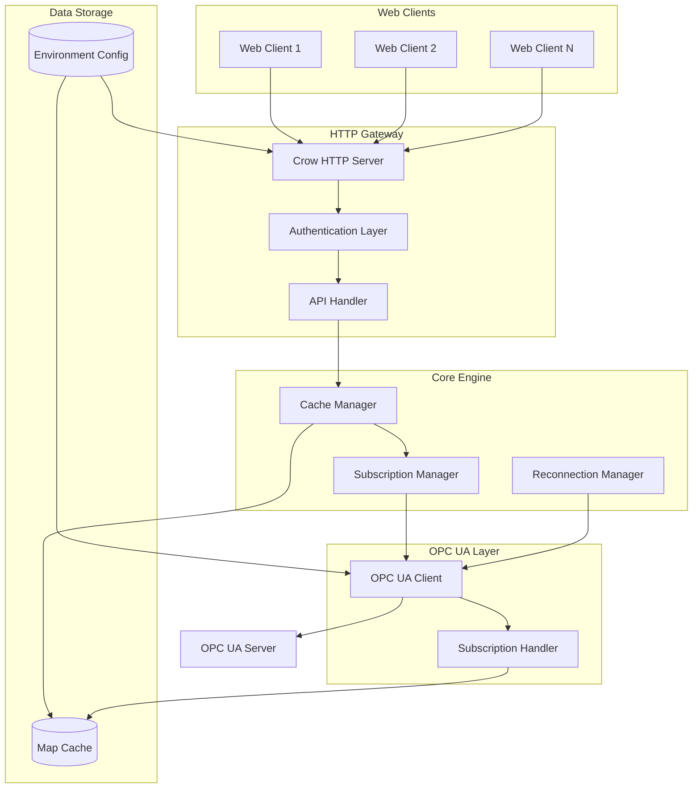

# Design Document

## Overview

本设计文档描述了OPC UA到HTTP桥接系统的架构和实现方案。系统基于现有的open62541、crow和nlohmann-json技术栈，核心创新是实现智能缓存和按需订阅机制。

### 核心设计理念

- **按需订阅**: 只有当Web客户端首次请求某个数据点时，才创建对应的OPC UA订阅
- **智能缓存**: 使用线程安全的map结构缓存所有订阅的数据点
- **自动恢复**: 连接断开时自动重连并恢复所有活跃订阅
- **高性能**: 后续请求直接从缓存返回，避免重复的OPC UA读取操作

## Architecture

### 系统架构图



### 核心组件

1. **HTTP服务层**: 基于Crow框架，处理REST API请求
2. **认证层**: 支持API Key和Basic Authentication
3. **缓存管理器**: 管理map数据结构，提供线程安全的数据访问
4. **订阅管理器**: 管理OPC UA订阅的生命周期
5. **重连管理器**: 处理连接断开和自动重连逻辑
6. **OPC UA客户端**: 基于open62541的连接和通信层

## Components and Interfaces

### 1. Cache Manager (缓存管理器)

```cpp
class CacheManager {
public:
    struct CacheEntry {
        std::string nodeId;
        std::string value;
        std::string status;
        std::string reason;
        uint64_t timestamp;
        std::chrono::steady_clock::time_point lastAccessed;
        bool hasSubscription;
    };
    
    // 获取缓存数据
    std::optional<CacheEntry> getCachedValue(const std::string& nodeId);
    
    // 更新缓存数据（来自订阅）
    void updateCache(const std::string& nodeId, const std::string& value, 
                    const std::string& status, const std::string& reason, 
                    uint64_t timestamp);
    
    // 添加新的缓存条目
    void addCacheEntry(const std::string& nodeId, const CacheEntry& entry);
    
    // 清理过期缓存
    void cleanupExpiredEntries();
    
    // 获取所有缓存的NodeId列表
    std::vector<std::string> getCachedNodeIds();
    
private:
    std::unordered_map<std::string, CacheEntry> cache_;
    std::shared_mutex cacheMutex_;
    std::chrono::minutes cacheExpireTime_{60}; // 可配置
};
```

### 2. Subscription Manager (订阅管理器)

```cpp
class SubscriptionManager {
public:
    SubscriptionManager(UA_Client* client, CacheManager* cacheManager);
    
    // 初始化订阅（创建主订阅）
    bool initializeSubscription();
    
    // 为NodeId创建监控项
    bool addMonitoredItem(const std::string& nodeId);
    
    // 删除监控项
    bool removeMonitoredItem(const std::string& nodeId);
    
    // 获取所有活跃监控项
    std::vector<std::string> getActiveMonitoredItems();
    
    // 重新创建所有监控项（用于重连后）
    bool recreateAllMonitoredItems();
    
    // 清理未使用的监控项
    void cleanupUnusedItems();
    
    // 静态回调函数 - 符合open62541 API
    static void dataChangeNotificationCallback(UA_Client *client, UA_UInt32 subId, 
                                             void *subContext, UA_UInt32 monId, 
                                             void *monContext, UA_DataValue *value);
    
    static void subscriptionInactivityCallback(UA_Client *client, UA_UInt32 subId, 
                                             void *subContext);
    
private:
    struct MonitoredItemInfo {
        std::string nodeId;
        UA_UInt32 monitoredItemId;
        UA_UInt32 clientHandle;
        std::chrono::steady_clock::time_point lastAccessed;
    };
    
    std::unordered_map<std::string, MonitoredItemInfo> activeMonitoredItems_;
    std::mutex subscriptionMutex_;
    
    UA_Client* opcClient_;
    CacheManager* cacheManager_;
    UA_UInt32 subscriptionId_;
    
    // 配置参数
    std::chrono::minutes itemExpireTime_{30}; // 可配置
    
    // 辅助方法
    UA_CreateSubscriptionResponse createOPCSubscription();
    UA_MonitoredItemCreateResult createMonitoredItem(const std::string& nodeId);
};
```

### 3. OPC UA Client Wrapper

```cpp
class OPCUAClient {
public:
    // 初始化客户端配置
    bool initialize(const Configuration& config);
    
    // 连接到OPC UA服务器
    bool connect();
    
    // 断开连接
    void disconnect();
    
    // 检查连接状态
    bool isConnected();
    
    // 获取原始UA_Client指针（供订阅管理器使用）
    UA_Client* getClient() { return client_; }
    
    // 读取单个节点值
    ReadResult readNode(const std::string& nodeId);
    
    // 批量读取节点值
    std::vector<ReadResult> readNodes(const std::vector<std::string>& nodeIds);
    
    // 连接状态变化回调
    static void stateCallback(UA_Client *client, UA_SecureChannelState channelState,
                            UA_SessionState sessionState, UA_StatusCode recoveryStatus);
    
private:
    UA_Client* client_;
    UA_ClientConfig* config_;
    std::string endpoint_;
    std::atomic<bool> connected_;
    std::mutex clientMutex_;
    
    // 配置参数
    UA_MessageSecurityMode securityMode_;
    std::string securityPolicy_;
    std::string applicationUri_;
    
    // 辅助方法
    UA_NodeId parseNodeId(const std::string& nodeIdStr);
    ReadResult convertDataValue(const std::string& nodeId, const UA_DataValue& dataValue);
    std::string statusCodeToString(UA_StatusCode statusCode);
    bool createSubscription();
    bool addMonitoredItem(const std::string& nodeId, 
                         std::function<void(const std::string&, const ReadResult&)> callback);
    
    // 删除监控项
    bool removeMonitoredItem(const std::string& nodeId);
    
    // 运行客户端事件循环
    void runIterate();
    
private:
    UA_Client* client_;
    std::string endpoint_;
    bool connected_;
    std::mutex clientMutex_;
    
    // 订阅相关
    UA_UInt32 subscriptionId_;
    std::unordered_map<std::string, UA_UInt32> monitoredItems_;
    std::unordered_map<UA_UInt32, std::string> monitoredItemsReverse_;
    std::unordered_map<std::string, std::function<void(const std::string&, const ReadResult&)>> callbacks_;
    
    // 静态回调函数
    static void dataChangeNotificationCallback(UA_Client *client, UA_UInt32 subId, void *subContext,
                                             UA_UInt32 monId, void *monContext, UA_DataValue *value);
    
    // 辅助函数
    UA_NodeId parseNodeId(const std::string& nodeIdStr);
    ReadResult convertDataValue(const std::string& nodeId, const UA_DataValue* value);
};
```

### 4. HTTP API Handler

```cpp
class APIHandler {
public:
    APIHandler(CacheManager* cacheManager, SubscriptionManager* subscriptionManager, 
               OPCUAClient* opcClient, const Configuration& config);
    
    // 设置Crow路由
    void setupRoutes(crow::SimpleApp& app);
    
    // 处理/iotgateway/read请求
    crow::response handleReadRequest(const crow::request& req);
    
    // 认证中间件
    bool authenticateRequest(const crow::request& req);
    
    // CORS处理
    void setupCORS(crow::SimpleApp& app);
    
private:
    CacheManager* cacheManager_;
    SubscriptionManager* subscriptionManager_;
    OPCUAClient* opcClient_;
    Configuration config_;
    
    // 辅助方法
    std::vector<std::string> parseNodeIds(const std::string& idsParam);
    nlohmann::json buildReadResponse(const std::vector<ReadResult>& results);
    crow::response buildErrorResponse(int statusCode, const std::string& message);
    crow::response buildJSONResponse(const nlohmann::json& data, int statusCode = 200);
    
    // 认证辅助方法
    bool validateAPIKey(const std::string& apiKey);
    bool validateBasicAuth(const std::string& authHeader);
};
```

### 5. Reconnection Manager (重连管理器)

```cpp
class ReconnectionManager {
public:
    ReconnectionManager(OPCUAClient* client, SubscriptionManager* subscriptionManager);
    
    // 开始监控连接状态
    void startMonitoring();
    
    // 停止监控
    void stopMonitoring();
    
    // 检查连接状态并处理重连
    void checkConnectionStatus();
    
private:
    std::thread monitorThread_;
    std::atomic<bool> monitoring_;
    std::atomic<bool> reconnecting_;
    
    OPCUAClient* opcClient_;
    SubscriptionManager* subscriptionManager_;
    
    // 重连配置参数（从环境变量读取）
    int connectionRetryMax_;
    int connectionInitialDelay_;
    int connectionMaxRetry_;
    int connectionMaxDelay_;
    int connectionRetryDelay_;
    
    // 重连逻辑
    bool attemptReconnection();
    void exponentialBackoff(int attempt);
    
    // 连接状态检查
    bool isConnectionHealthy();
};
```

## Data Models

### ReadResult 结构

```cpp
struct ReadResult {
    std::string id;           // NodeId
    bool success;             // 成功状态 (s字段)
    std::string reason;       // 状态描述 (r字段)
    std::string value;        // 读取值 (v字段)
    uint64_t timestamp;       // 时间戳 (t字段)
    
    // 转换为JSON - 使用nlohmann::json的现代C++语法
    nlohmann::json toJson() const {
        return nlohmann::json{
            {"id", id},
            {"s", success},
            {"r", reason},
            {"v", value},
            {"t", timestamp}
        };
    }
    
    // 从JSON构造 - 支持反序列化
    static ReadResult fromJson(const nlohmann::json& j) {
        ReadResult result;
        j.at("id").get_to(result.id);
        j.at("s").get_to(result.success);
        j.at("r").get_to(result.reason);
        j.at("v").get_to(result.value);
        j.at("t").get_to(result.timestamp);
        return result;
    }
};

// 为nlohmann::json提供自动序列化支持
NLOHMANN_DEFINE_TYPE_NON_INTRUSIVE(ReadResult, id, success, reason, value, timestamp);
```

### Configuration 结构

```cpp
struct Configuration {
    // OPC UA配置
    std::string opcEndpoint;
    int securityMode;
    std::string securityPolicy;
    int defaultNamespace;
    std::string applicationUri;
    
    // 连接配置
    int connectionRetryMax;
    int connectionInitialDelay;
    int connectionMaxRetry;
    int connectionMaxDelay;
    int connectionRetryDelay;
    
    // Web服务器配置
    int serverPort;
    
    // 安全配置
    std::string apiKey;
    std::string authUsername;
    std::string authPassword;
    std::vector<std::string> allowedOrigins;
    
    // 缓存配置
    int cacheExpireMinutes;
    int subscriptionCleanupMinutes;
    
    // 从环境变量加载
    static Configuration loadFromEnvironment();
};
```

## Error Handling

### 错误分类和处理策略

1. **OPC UA连接错误**
   - 连接超时: 触发重连机制
   - 认证失败: 记录错误，停止重连
   - 网络错误: 启动重连流程

2. **HTTP请求错误**
   - 参数缺失: 返回400 Bad Request
   - 认证失败: 返回401 Unauthorized
   - 内部错误: 返回500 Internal Server Error

3. **缓存操作错误**
   - 内存不足: 触发缓存清理
   - 并发冲突: 使用读写锁保护

4. **订阅管理错误**
   - 订阅创建失败: 记录错误，返回缓存数据
   - 订阅断开: 尝试重新创建

### 错误恢复机制

```cpp
class ErrorHandler {
public:
    enum class ErrorType {
        CONNECTION_LOST,
        SUBSCRIPTION_FAILED,
        CACHE_ERROR,
        HTTP_ERROR
    };
    
    void handleError(ErrorType type, const std::string& details);
    
private:
    void handleConnectionError();
    void handleSubscriptionError(const std::string& nodeId);
    void handleCacheError();
};
```

## Testing Strategy

### 单元测试

1. **CacheManager测试**
   - 缓存CRUD操作
   - 线程安全性测试
   - 过期清理机制

2. **SubscriptionManager测试**
   - 订阅创建和删除
   - 批量订阅管理
   - 重连后订阅恢复

3. **OPCUAClient测试**
   - 连接建立和断开
   - 数据读取操作
   - 错误处理

### 集成测试

1. **端到端API测试**
   - HTTP请求处理流程
   - 认证机制验证
   - JSON响应格式

2. **OPC UA集成测试**
   - 与真实OPC UA服务器交互
   - 订阅数据变化处理
   - 连接断开恢复

3. **性能测试**
   - 并发请求处理
   - 缓存性能测试
   - 内存使用监控

### 测试环境配置

```cpp
class TestEnvironment {
public:
    // 启动模拟OPC UA服务器
    void startMockOPCServer();
    
    // 配置测试环境变量
    void setupTestConfiguration();
    
    // 清理测试数据
    void cleanup();
    
private:
    std::unique_ptr<MockOPCServer> mockServer_;
};
```

## Implementation Flow

### 系统启动流程

1. **配置加载**: 从环境变量读取所有配置参数
2. **OPC UA客户端初始化**: 创建UA_Client并配置连接参数
3. **HTTP服务器启动**: 启动Crow服务器监听指定端口
4. **缓存管理器初始化**: 创建空的map缓存
5. **重连管理器启动**: 开始监控连接状态

### HTTP请求处理流程

```mermaid
sequenceDiagram
    participant Client as Web Client
    participant HTTP as HTTP Server
    participant Cache as Cache Manager
    participant Sub as Subscription Manager
    participant OPC as OPC UA Client
    participant Server as OPC UA Server

    Client->>HTTP: GET /iotgateway/read?ids=ns=2;s=Var1,ns=2;s=Var2
    HTTP->>Cache: getCachedValue(ns=2;s=Var1)
    
    alt 缓存命中
        Cache-->>HTTP: 返回缓存数据
    else 缓存未命中
        Cache-->>HTTP: 返回空
        HTTP->>OPC: readNode(ns=2;s=Var1)
        OPC->>Server: UA_Client_readValueAttribute
        Server-->>OPC: 返回数据值
        OPC-->>HTTP: ReadResult
        HTTP->>Cache: addCacheEntry(ns=2;s=Var1, data)
        HTTP->>Sub: addMonitoredItem(ns=2;s=Var1)
        Sub->>OPC: 创建监控项
        OPC->>Server: UA_Client_MonitoredItems_createDataChange
    end
    
    HTTP-->>Client: JSON响应
    
    Note over Server,Cache: 后续数据变化通过订阅自动更新缓存
    Server->>OPC: 数据变化通知
    OPC->>Sub: dataChangeCallback
    Sub->>Cache: updateCache(nodeId, newValue)
```

### 订阅和缓存更新流程

1. **首次请求**: 主动读取数据并创建监控项
2. **订阅创建**: 使用open62541的订阅API创建监控项
3. **数据变化通知**: 通过回调函数接收数据更新
4. **缓存更新**: 立即更新map缓存中的对应数据
5. **后续请求**: 直接从缓存返回最新数据

### 重连和恢复流程

1. **连接监控**: 定期检查UA_Client连接状态
2. **断线检测**: 检测到连接断开时记录状态
3. **重连尝试**: 使用指数退避算法进行重连
4. **订阅恢复**: 重连成功后重新创建所有监控项
5. **缓存保持**: 重连期间保持缓存数据不变

### 6. Application Main Class

```cpp
class OPCUAHTTPBridge {
public:
    OPCUAHTTPBridge();
    ~OPCUAHTTPBridge();
    
    // 初始化应用程序
    bool initialize();
    
    // 启动服务器
    void run();
    
    // 停止服务器
    void stop();
    
private:
    // 核心组件
    std::unique_ptr<Configuration> config_;
    std::unique_ptr<OPCUAClient> opcClient_;
    std::unique_ptr<CacheManager> cacheManager_;
    std::unique_ptr<SubscriptionManager> subscriptionManager_;
    std::unique_ptr<ReconnectionManager> reconnectionManager_;
    std::unique_ptr<APIHandler> apiHandler_;
    
    // Crow应用程序
    std::unique_ptr<crow::SimpleApp> app_;
    
    // 运行状态
    std::atomic<bool> running_;
    std::thread serverThread_;
    
    // 初始化方法
    bool initializeConfiguration();
    bool initializeOPCClient();
    bool initializeComponents();
    bool setupHTTPServer();
    
    // 信号处理
    static void signalHandler(int signal);
    static OPCUAHTTPBridge* instance_;
};
```

## Performance Considerations

### 缓存优化

1. **内存管理**: 定期清理未访问的缓存条目
2. **并发访问**: 使用读写锁优化多线程访问
3. **数据结构**: 使用unordered_map提供O(1)查找性能

### 网络优化

1. **批量操作**: 支持批量读取多个NodeId
2. **连接复用**: 维护单一OPC UA连接
3. **订阅优化**: 避免重复订阅同一数据点

### 资源管理

1. **线程池**: Crow框架内置线程池处理HTTP请求
2. **内存监控**: 监控缓存内存使用，定期清理过期条目
3. **连接管理**: 自动管理OPC UA连接生命周期和重连机制

## Implementation Example

### 主函数示例

```cpp
#include "crow.h"
#include "json.hpp"
#include "open62541/client.h"
#include "OPCUAHTTPBridge.h"

int main() {
    try {
        // 创建应用程序实例
        OPCUAHTTPBridge bridge;
        
        // 初始化
        if (!bridge.initialize()) {
            std::cerr << "Failed to initialize OPC UA HTTP Bridge" << std::endl;
            return 1;
        }
        
        std::cout << "OPC UA HTTP Bridge starting..." << std::endl;
        
        // 运行服务器
        bridge.run();
        
    } catch (const std::exception& e) {
        std::cerr << "Error: " << e.what() << std::endl;
        return 1;
    }
    
    return 0;
}
```

### Crow路由设置示例

```cpp
void APIHandler::setupRoutes(crow::SimpleApp& app) {
    // 设置CORS
    setupCORS(app);
    
    // 主要API端点
    CROW_ROUTE(app, "/iotgateway/read")
    .methods("GET"_method)
    ([this](const crow::request& req) {
        // 认证检查
        if (!authenticateRequest(req)) {
            return buildErrorResponse(401, "Unauthorized");
        }
        
        return handleReadRequest(req);
    });
    
    // 健康检查端点
    CROW_ROUTE(app, "/health")
    ([this]() {
        nlohmann::json health = {
            {"status", "ok"},
            {"timestamp", std::chrono::duration_cast<std::chrono::milliseconds>(
                std::chrono::system_clock::now().time_since_epoch()).count()},
            {"cached_items", cacheManager_->getCachedNodeIds().size()},
            {"active_subscriptions", subscriptionManager_->getActiveMonitoredItems().size()}
        };
        return buildJSONResponse(health);
    });
}
```

### Open62541特定优化

1. **客户端配置**: 使用UA_ClientConfig_setDefault进行标准配置
2. **线程安全**: 利用open62541的UA_THREADSAFE API
3. **事件循环**: 使用UA_Client_run_iterate进行非阻塞操作
4. **内存管理**: 正确使用UA_Variant_clear等清理函数